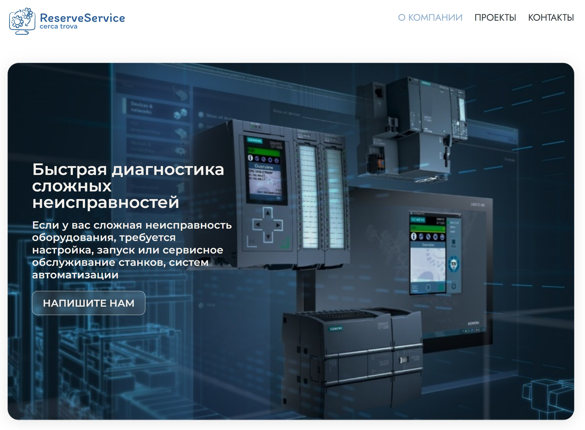
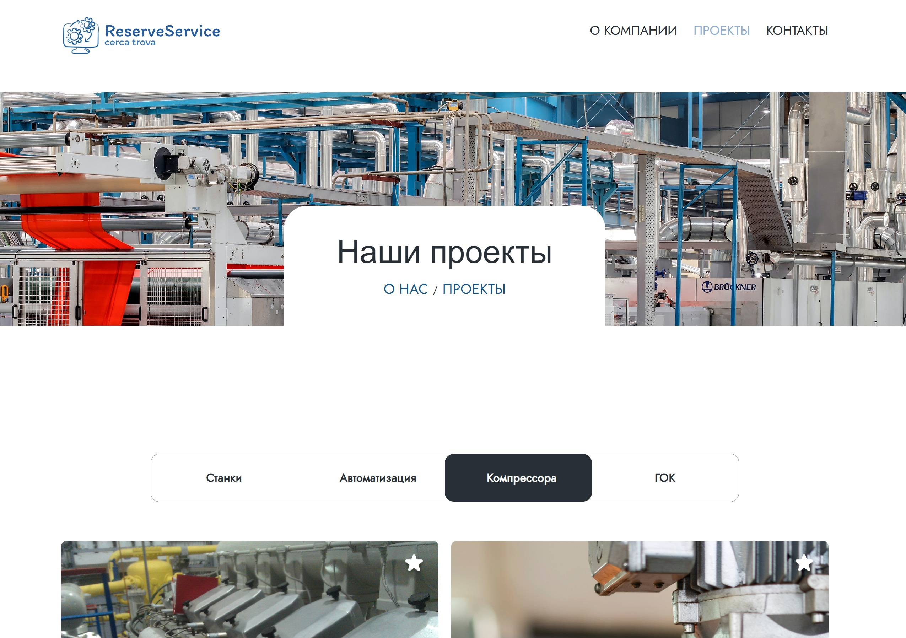
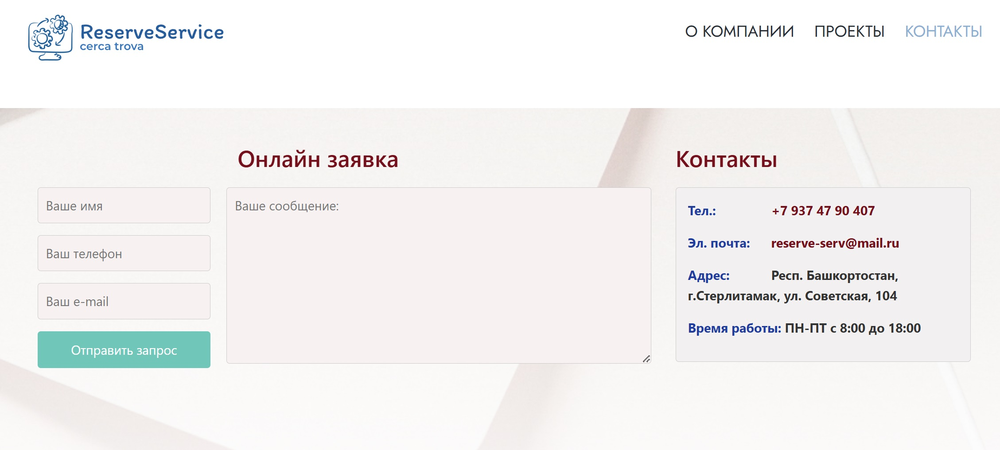

## Дипломный проект: Веб-приложение ReserveService на Vue.js 3.


_Данное SPA-приложение можно использовать как платформу для создания системы он-лайн заявок для сервисного обслуживания промышленного оборудования_

### 🚀 Основные функции:

- Рекламная функция
- Онлайн-заявки на диагностику оборудования
- Каталог выполненных проектов с фильтрацией <br>

#### Можно развить следующие функции на базе данной платформы:

- Выбор понравившихся работ и включение их списком в он-лайн заявку

### 🛠 Технологический стек:2

- Git
- Vue.js 3
- Vuex
- Vue Router
- SCSS
- Flexbox
- Grid
- Swiper JS library
- Formspree.io
- gh-pages

## Техническое задание

[Техническое задание] (произвольно выбранное, согласованное с представителями Geek Brains)

## Ссылка на макет проекта

В качестве макета использовался уже имеющийся сайт, посмотеть [макет](https://reserve-service.ru/)

## Ссылка на GitHub Pages

Посмотреть [Сайт ReserveService](https://lmstrgb.github.io/6_GB_diploma/ReserveService/)

## 🖥 Снимки экрана интерфейса

**Главная страница**



**Проекты**



**Контакты**



## Реализованные задачи

1. Применение HTML, CSS, JavaScript, Vue.js.
2. Использование flexbox, Grid, формат изображений svg, png, jpg.
3. Использование библиотеки Swiper JS для создания слайдера на странице Project Details (при двойном нажатии на изображение слайдера оно увеличивается для предпросмотра)
4. Реализован компонентный подход для добавления похожих блоков на сайте:
   - Header
   - Footer
   - ArticleCard
   - BlackButton
   - Navigation
   - Pagination
   - Slider
5. Все ссылки работают через VueRouting и являются переходами на страницы. Нерабочая ссылка ведет на страницу NotFound (404).

6. На странице Blog Details

- Добавлены несколько произвольных статей, с описанием. По нажатию на кнопки в разделе «Tags» происходит сортировка статей по хештегам "Станки", "Автоматизация", "Компрессоры", "ГОК".

7. На странице Project

   - Реализована пагинация для перемещения по страницам в категориях "Станки", "Автоматизация", "Компрессоры", "ГОК" Добавлены несколько произвольных статей, с описанием. По нажатию на кнопки в разделе «Tags» происходит сортировка статей по хештегам "Станки", "Автоматизация", "Компрессоры", "ГОК".
   - Добавлен функционал лайков (звёздочки). При наведении на любой компонент проекта изначально звёздочка прозрачная, при нажатии на неё, она окрашивается оранжевым цветом.

8. Кнопка «Back to home» на странице NotFound(404) ведет на главную страницу.
9. Возможность отправки он-лайн заявок на странице Contacts. Используется бесплатный сервис Formspree.io.
10. Сайт выполнен в десктопной версии.

## Настройка проекта

```
npm install
```

### Компиляция и выполнение горячей перезагрузки для разработки

```
npm run serve
```

### Компиляция и сжатие для продакшена

```
npm run build
```

### Настройка конфигурации, развёртывание проекта на GitHub

Посмотреть [Configuration Reference](https://cli.vuejs.org/guide/deployment.html)

🔗 Ссылки:

[Демо-версия](https://lmstrgb.github.io/6_GB_diploma/ReserveService/)

[Исходный код](https://github.com/Lmstrgb/6_GB_diploma/tree/main/ReserveService-diplom)
